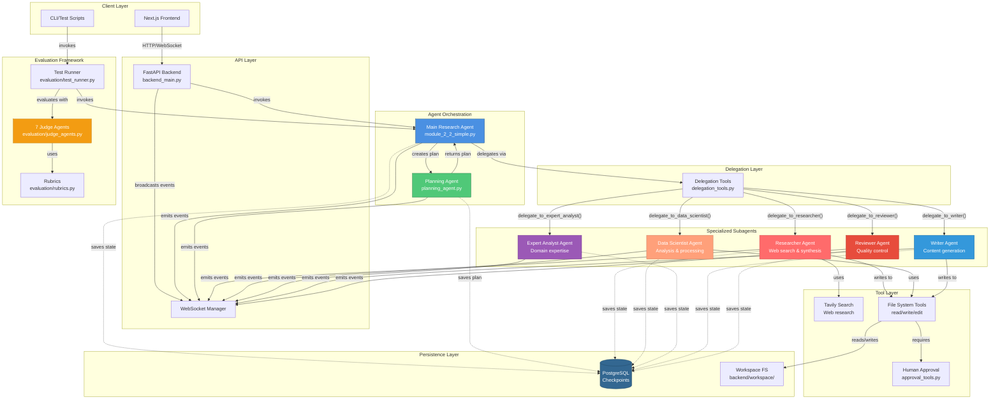
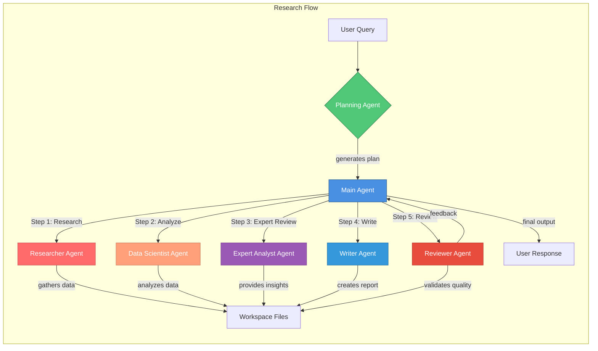
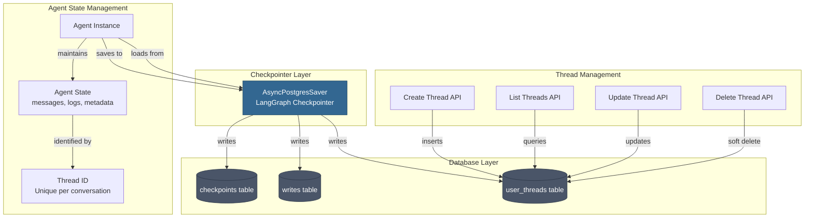
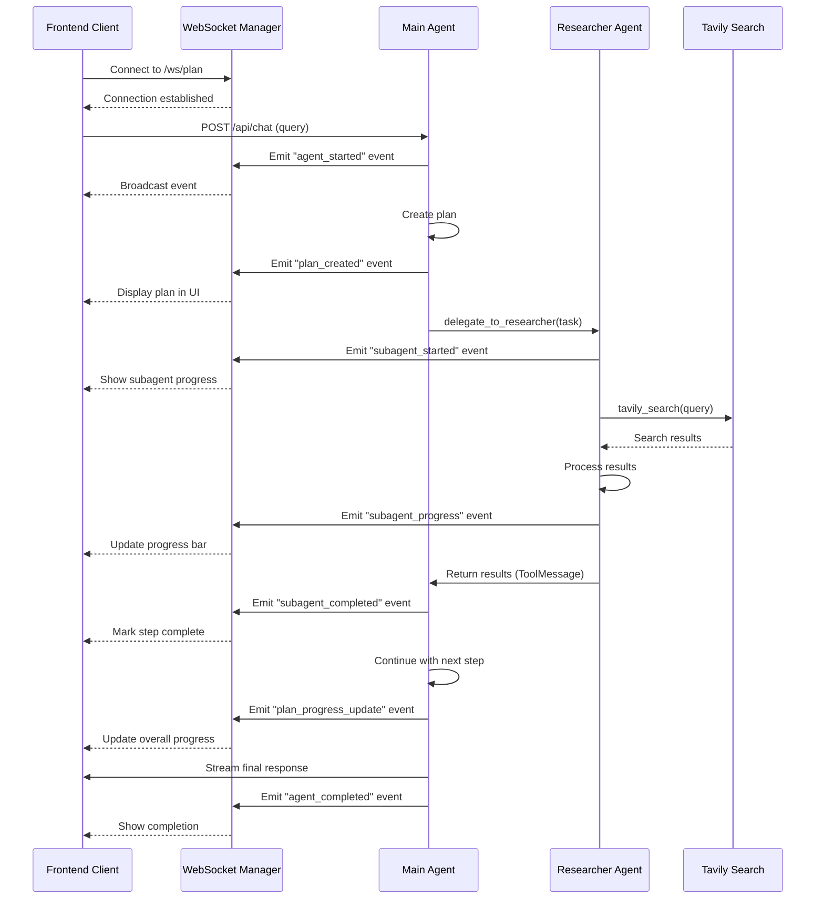
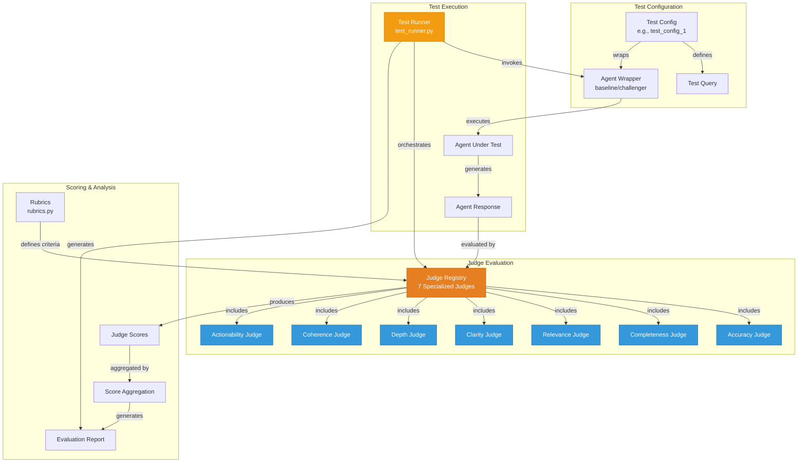

# Agent Architecture Diagram

## Multi-Agent System Overview

## Agent Hierarchy Detailed View

## State Persistence Architecture

## Real-Time Communication Flow

## Evaluation Framework Architecture

---

## Legend

### Agent Types
- 🔵 **Main Agent** - Orchestrates the entire workflow
- 🟢 **Planning Agent** - Creates and manages execution plans
- 🔴 **Researcher Agent** - Web search and information gathering
- 🟠 **Data Scientist Agent** - Data analysis and processing
- 🟣 **Expert Analyst Agent** - Domain-specific expertise
- 🔵 **Writer Agent** - Content creation and synthesis
- 🔴 **Reviewer Agent** - Quality assurance and validation
- 🟡 **Judge Agents** - Evaluation and scoring

### Communication Patterns
- **Solid arrows** - Direct invocation/delegation
- **Dashed arrows** - State persistence
- **WebSocket events** - Real-time updates to frontend

### Persistence
- **PostgreSQL** - Conversation state and checkpoints
- **Workspace FS** - File-based artifacts (reports, data)

---

**Last Updated**: November 2025  
**Generated from**: ATLAS/TandemAI codebase analysis

