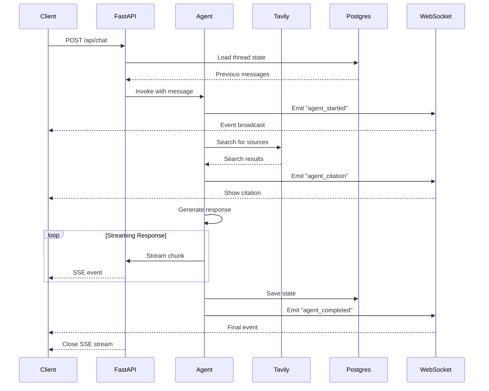
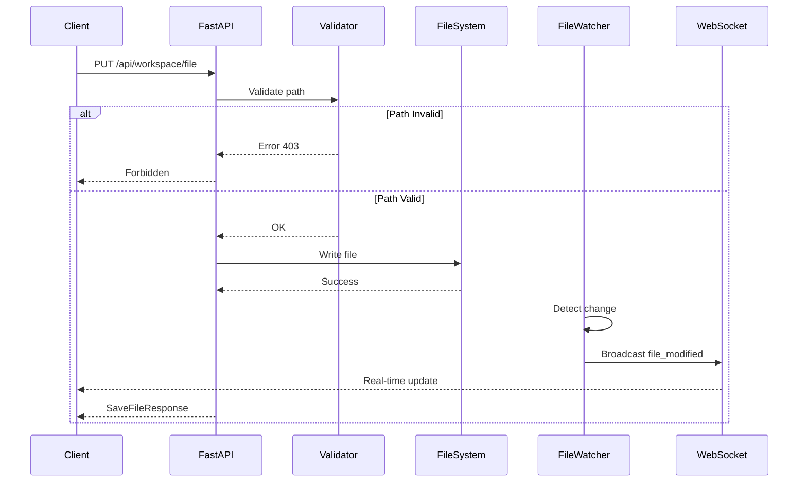
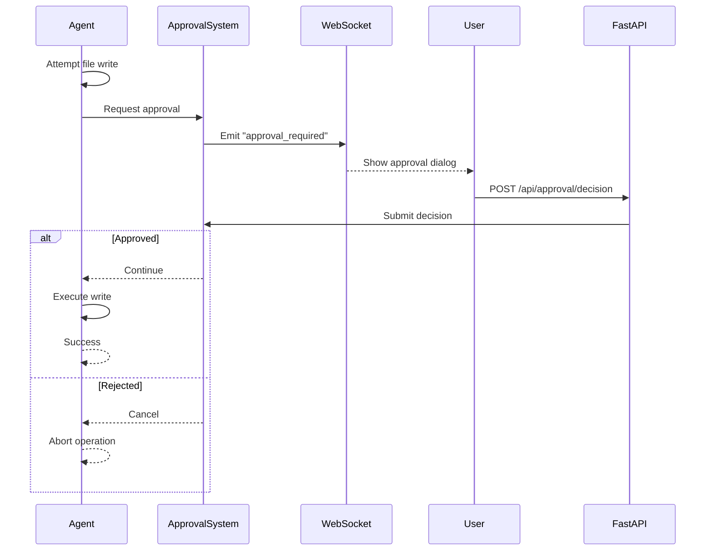

# API Endpoint Map

## Complete REST & WebSocket API Reference

### API Endpoint Overview

```mermaid
graph TB
    subgraph "Frontend Clients"
        WebUI[Web UI - Next.js]
        Mobile[Mobile Clients]
        CLI[CLI Tools]
    end
    
    subgraph "API Gateway - FastAPI"
        Gateway[backend_main.py<br/>Port 8000]
    end
    
    subgraph "Research & Chat APIs"
        ChatAPI[POST /api/chat<br/>Streaming research]
        PlanStart[POST /api/research/plan/start<br/>Create execution plan]
        PlanState[GET /api/research/plan/:id<br/>Get plan state]
        ConvHistory[GET /api/conversation/history<br/>Thread history]
    end
    
    subgraph "Workspace File APIs"
        FileTree[GET /api/workspace/tree<br/>Directory structure]
        FileRead[GET /api/workspace/file<br/>Read file content]
        FileUpdate[PUT /api/workspace/file<br/>Update file]
        FileCreate[POST /api/workspace/file/new<br/>Create new file]
        FolderCreate[POST /api/workspace/folder/new<br/>Create folder]
    end
    
    subgraph "Thread Management APIs"
        ThreadCreate[POST /api/threads/create<br/>New conversation]
        ThreadList[GET /api/threads/list<br/>List user threads]
        ThreadUpdate[PUT /api/threads/:id/title<br/>Update title]
        ThreadDelete[DELETE /api/threads/:id<br/>Archive/delete]
    end
    
    subgraph "Auth & Approval APIs"
        TokenCreate[POST /api/auth/token<br/>JWT generation]
        ApprovalDecision[POST /api/approval/decision<br/>Human approval]
    end
    
    subgraph "WebSocket Endpoints"
        WSPlan[WS /ws/plan<br/>Real-time plan updates]
        WSWorkspace[WS /ws/workspace/:path<br/>File change events]
    end
    
    subgraph "Health & Monitoring"
        Health[GET /health<br/>Service status]
    end
    
    WebUI --> Gateway
    Mobile --> Gateway
    CLI --> Gateway
    
    Gateway --> ChatAPI
    Gateway --> PlanStart
    Gateway --> PlanState
    Gateway --> ConvHistory
    
    Gateway --> FileTree
    Gateway --> FileRead
    Gateway --> FileUpdate
    Gateway --> FileCreate
    Gateway --> FolderCreate
    
    Gateway --> ThreadCreate
    Gateway --> ThreadList
    Gateway --> ThreadUpdate
    Gateway --> ThreadDelete
    
    Gateway --> TokenCreate
    Gateway --> ApprovalDecision
    
    Gateway --> WSPlan
    Gateway --> WSWorkspace
    
    Gateway --> Health
    
    style Gateway fill:#4A90E2,stroke:#2E5C8A,color:#fff
    style ChatAPI fill:#FF6B6B,stroke:#CC5555,color:#fff
    style PlanStart fill:#50C878,stroke:#2E7D4E,color:#fff
    style WSPlan fill:#9B59B6,stroke:#7A3D91,color:#fff
    style WSWorkspace fill:#9B59B6,stroke:#7A3D91,color:#fff
```



## Detailed API Specifications

### 1. Research & Chat APIs

#### POST /api/chat
**Purpose**: Stream AI research responses with real-time updates

**Request Body**:
```json
{
  "message": "Research quantum computing trends in 2025",
  "thread_id": "thread-uuid-1234",
  "user_id": "user-123"
}
```

**Response**: Server-Sent Events (SSE) stream
```
event: agent_thinking
data: {"content": "Analyzing your research question..."}

event: agent_progress
data: {"step": "Searching for sources", "progress": 0.3}

event: agent_citation
data: {"title": "Quantum Computing Report 2025", "url": "https://..."}

event: agent_message
data: {"content": "Based on recent research...", "done": false}

event: agent_completed
data: {"final_message": "Research complete", "done": true}
```

**Events Emitted**:
- `agent_thinking` - Agent is processing
- `agent_progress` - Progress updates
- `agent_citation` - Source citation discovered
- `agent_message` - Partial response chunk
- `agent_completed` - Final completion
- `agent_error` - Error occurred

---

#### POST /api/research/plan/start
**Purpose**: Create a structured research plan

**Request Body**:
```json
{
  "query": "Analyze the impact of AI on healthcare",
  "num_steps": 5,
  "thread_id": "thread-uuid-5678",
  "user_id": "user-123"
}
```

**Response Model**: `ResearchPlanResponse`
```json
{
  "plan_id": "plan-uuid-abcd",
  "thread_id": "thread-uuid-5678",
  "steps": [
    "Research current AI applications in healthcare",
    "Analyze benefits and challenges",
    "Review case studies",
    "Assess future trends",
    "Compile comprehensive report"
  ],
  "status": "active",
  "created_at": "2025-11-27T20:00:00Z"
}
```

---

#### GET /api/research/plan/{thread_id}
**Purpose**: Get current state of research plan

**Response Model**: `PlanStateResponse`
```json
{
  "plan_id": "plan-uuid-abcd",
  "steps": ["Step 1", "Step 2", "Step 3"],
  "current_step": 1,
  "progress": 0.4,
  "past_steps": [
    {"step": "Step 1", "result": "Completed research"}
  ],
  "status": "in_progress"
}
```

---

#### GET /api/conversation/history
**Purpose**: Retrieve conversation history for a thread

**Query Parameters**:
- `thread_id` (required): Thread identifier
- `limit` (optional): Number of messages (default: 50)

**Response Model**: `ConversationHistoryResponse`
```json
{
  "thread_id": "thread-uuid-1234",
  "messages": [
    {
      "role": "user",
      "content": "Research quantum computing",
      "timestamp": "2025-11-27T19:00:00Z"
    },
    {
      "role": "assistant",
      "content": "I'll research that for you...",
      "timestamp": "2025-11-27T19:00:05Z"
    }
  ],
  "total_count": 24
}
```

---

### 2. Workspace File APIs

#### GET /api/workspace/tree
**Purpose**: Get complete workspace directory structure

**Response Model**: `List[FileNode]`
```json
[
  {
    "id": "node-1",
    "name": "reports",
    "path": "reports",
    "type": "directory",
    "children": [
      {
        "id": "node-2",
        "name": "research_report.md",
        "path": "reports/research_report.md",
        "type": "file",
        "size": 15420,
        "extension": "md",
        "lastModified": 1732738800.0
      }
    ],
    "lastModified": 1732738800.0
  }
]
```

---

#### GET /api/workspace/file
**Purpose**: Read file content from workspace

**Query Parameters**:
- `path` (required): Relative file path

**Response Model**: `FileContent`
```json
{
  "content": "# Research Report\n\n## Introduction\n...",
  "metadata": {
    "size": 15420,
    "lastModified": 1732738800.0,
    "extension": "md"
  }
}
```

**Error Responses**:
- `403` - Path outside workspace (security)
- `404` - File not found

---

#### PUT /api/workspace/file
**Purpose**: Update existing file content

**Request Body**:
```json
{
  "path": "reports/research_report.md",
  "content": "# Updated Report\n\n..."
}
```

**Response Model**: `SaveFileResponse`
```json
{
  "success": true,
  "message": "File updated successfully",
  "metadata": {
    "size": 16000,
    "lastModified": 1732739000.0,
    "extension": "md"
  }
}
```

---

#### POST /api/workspace/file/new
**Purpose**: Create new file in workspace

**Request Body**:
```json
{
  "path": "reports/new_analysis.md",
  "content": "# New Analysis\n\n..."
}
```

**Response Model**: `SaveFileResponse`

**Validation**:
- Path cannot contain `..` (prevents traversal)
- Path cannot start with `/`
- Creates parent directories automatically

---

#### POST /api/workspace/folder/new
**Purpose**: Create new folder in workspace

**Request Body**:
```json
{
  "path": "reports/2025"
}
```

**Response**:
```json
{
  "success": true,
  "message": "Folder created",
  "path": "reports/2025"
}
```

---

### 3. Thread Management APIs

#### POST /api/threads/create
**Purpose**: Create new conversation thread

**Request Body**:
```json
{
  "thread_title": "Quantum Computing Research",
  "user_id": "user-123"
}
```

**Response Model**: `CreateThreadResponse`
```json
{
  "thread_id": "thread-uuid-9999",
  "thread_title": "Quantum Computing Research",
  "created_at": "2025-11-27T20:00:00Z"
}
```

---

#### GET /api/threads/list
**Purpose**: List all user threads

**Query Parameters**:
- `user_id` (default: "anonymous")
- `include_archived` (default: false)

**Response Model**: `ThreadListResponse`
```json
{
  "threads": [
    {
      "thread_id": "thread-uuid-1",
      "thread_title": "AI in Healthcare",
      "user_id": "user-123",
      "created_at": "2025-11-25T10:00:00Z",
      "updated_at": "2025-11-27T15:00:00Z",
      "message_count": 42,
      "is_archived": false
    }
  ],
  "total_count": 5
}
```

---

#### PUT /api/threads/{thread_id}/title
**Purpose**: Update thread title

**Request Body**:
```json
{
  "thread_title": "Updated Research Title"
}
```

**Response**:
```json
{
  "success": true,
  "thread_id": "thread-uuid-1",
  "thread_title": "Updated Research Title"
}
```

---

#### DELETE /api/threads/{thread_id}
**Purpose**: Archive or permanently delete thread

**Query Parameters**:
- `permanent` (default: false) - If true, hard delete

**Response**:
```json
{
  "success": true,
  "thread_id": "thread-uuid-1",
  "action": "archived"
}
```

---

### 4. Auth & Approval APIs

#### POST /api/auth/token
**Purpose**: Generate JWT access token

**Request Body**:
```json
{
  "username": "researcher1",
  "password": "secure_password"
}
```

**Response**:
```json
{
  "access_token": "eyJhbGciOiJIUzI1NiIs...",
  "token_type": "bearer",
  "expires_in": 3600
}
```

**Headers Required**: None (public endpoint)

---

#### POST /api/approval/decision
**Purpose**: Submit human approval decision for agent actions

**Request Body**:
```json
{
  "request_id": "approval-req-uuid",
  "approved": true,
  "feedback": "Looks good, proceed"
}
```

**Response**:
```json
{
  "success": true,
  "request_id": "approval-req-uuid",
  "action": "approved"
}
```

**Use Case**: When agent requests approval for file writes/edits

---

### 5. WebSocket Endpoints

#### WS /ws/plan
**Purpose**: Real-time plan execution updates

**Connection**: `ws://localhost:8000/ws/plan?thread_id=thread-123`

**Message Types Received**:

**Plan Created**:
```json
{
  "type": "plan_created",
  "thread_id": "thread-123",
  "plan_id": "plan-uuid",
  "steps": ["Step 1", "Step 2", "Step 3"],
  "progress": 0.0,
  "timestamp": "2025-11-27T20:00:00Z"
}
```

**Plan Progress**:
```json
{
  "type": "plan_progress_update",
  "thread_id": "thread-123",
  "current_step": 1,
  "progress": 0.33,
  "step_result": "Completed research phase",
  "timestamp": "2025-11-27T20:05:00Z"
}
```

**Subagent Events**:
```json
{
  "type": "subagent_started",
  "thread_id": "thread-123",
  "subagent_type": "researcher",
  "task": "Research quantum computing trends",
  "timestamp": "2025-11-27T20:06:00Z"
}
```

```json
{
  "type": "subagent_completed",
  "thread_id": "thread-123",
  "subagent_type": "researcher",
  "output_file": "/workspace/research.md",
  "timestamp": "2025-11-27T20:10:00Z"
}
```

---

#### WS /ws/workspace/{file_path:path}
**Purpose**: Real-time file change notifications

**Connection**: `ws://localhost:8000/ws/workspace/reports/analysis.md`

**Message Types Received**:

**File Modified**:
```json
{
  "type": "file_modified",
  "path": "reports/analysis.md",
  "size": 18500,
  "timestamp": "2025-11-27T20:15:00Z"
}
```

**File Created**:
```json
{
  "type": "file_created",
  "path": "reports/new_report.md",
  "size": 2400,
  "timestamp": "2025-11-27T20:16:00Z"
}
```

**File Deleted**:
```json
{
  "type": "file_deleted",
  "path": "reports/old_draft.md",
  "timestamp": "2025-11-27T20:17:00Z"
}
```

---

### 6. Health & Monitoring

#### GET /health
**Purpose**: Service health check

**Response**:
```json
{
  "status": "healthy",
  "version": "2.5",
  "websocket_enabled": true,
  "file_watcher_enabled": true,
  "active_connections": 3,
  "features": {
    "plan_tracking": true,
    "sqlite_persistence": true,
    "conversation_history": true,
    "thread_management": true
  }
}
```

---

## Request/Response Flow Diagrams

### Chat Request Flow



### File Operation Flow



### Approval Gate Flow



---

## CORS & Security

### Allowed Origins
Configured via `CORS_ORIGINS` environment variable:
- `http://localhost:3000` (Next.js dev)
- `http://localhost:3001` (alternative port)
- `http://localhost:3002`
- `http://localhost:3003`

### Authentication
- JWT tokens via `/api/auth/token`
- Bearer token in `Authorization` header
- Expiry: 60 minutes (configurable)

### Path Security
- All workspace paths validated against traversal attacks
- No `..` or leading `/` allowed
- Paths resolved and checked within workspace root

---

**Last Updated**: November 2025  
**Generated from**: backend/backend_main.py analysis

