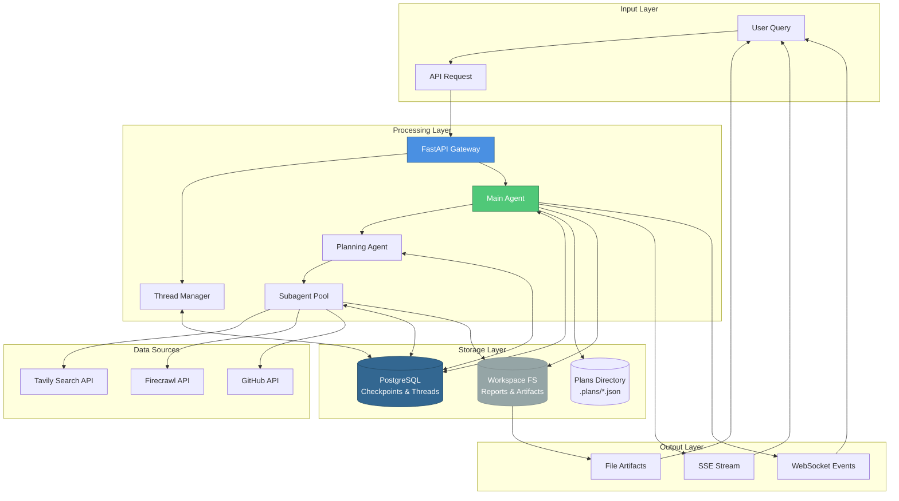
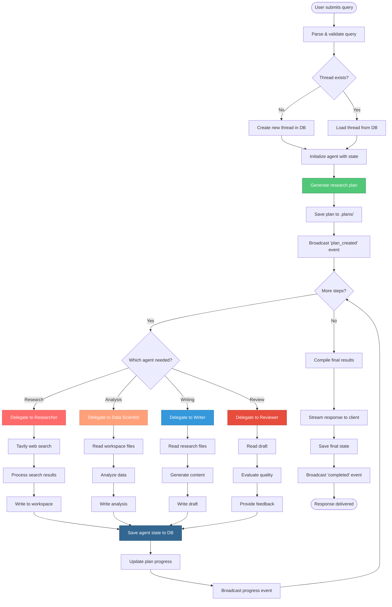
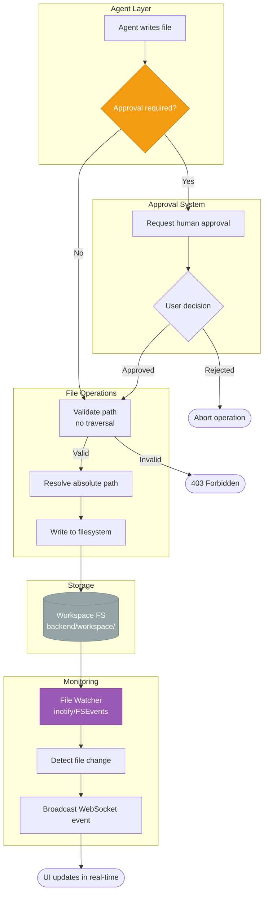
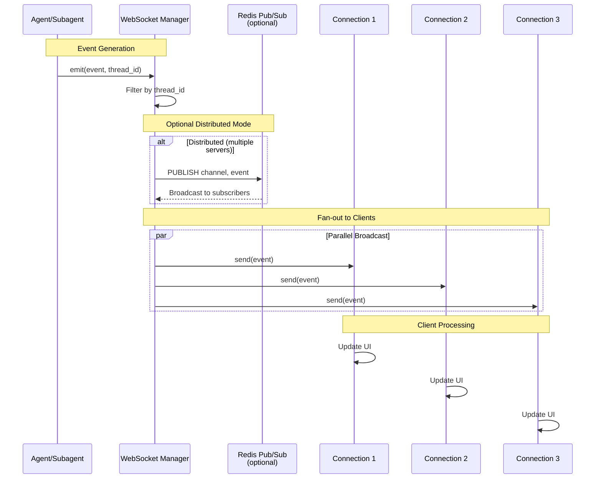
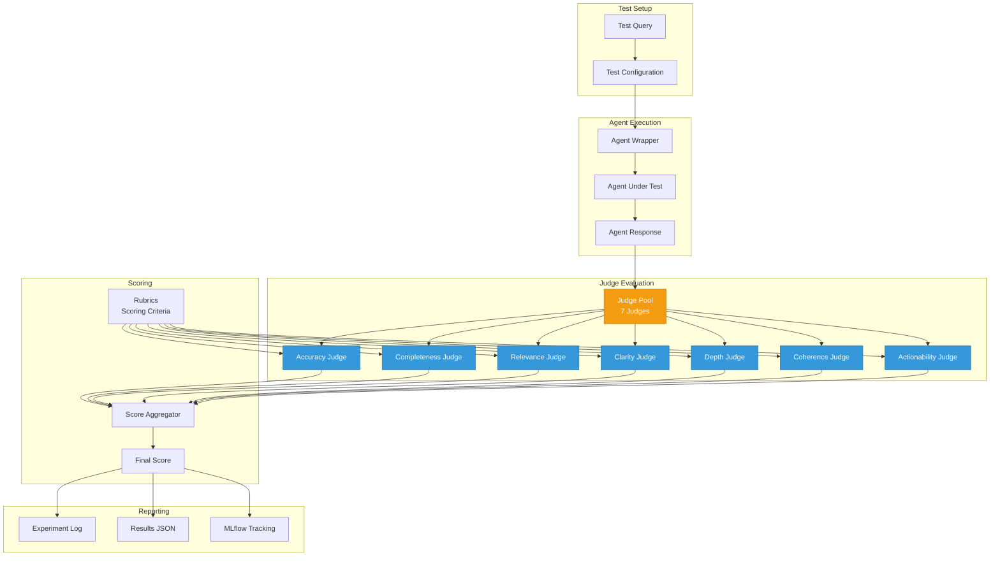
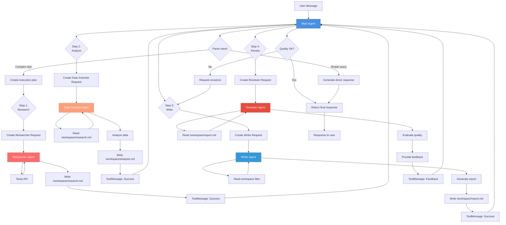
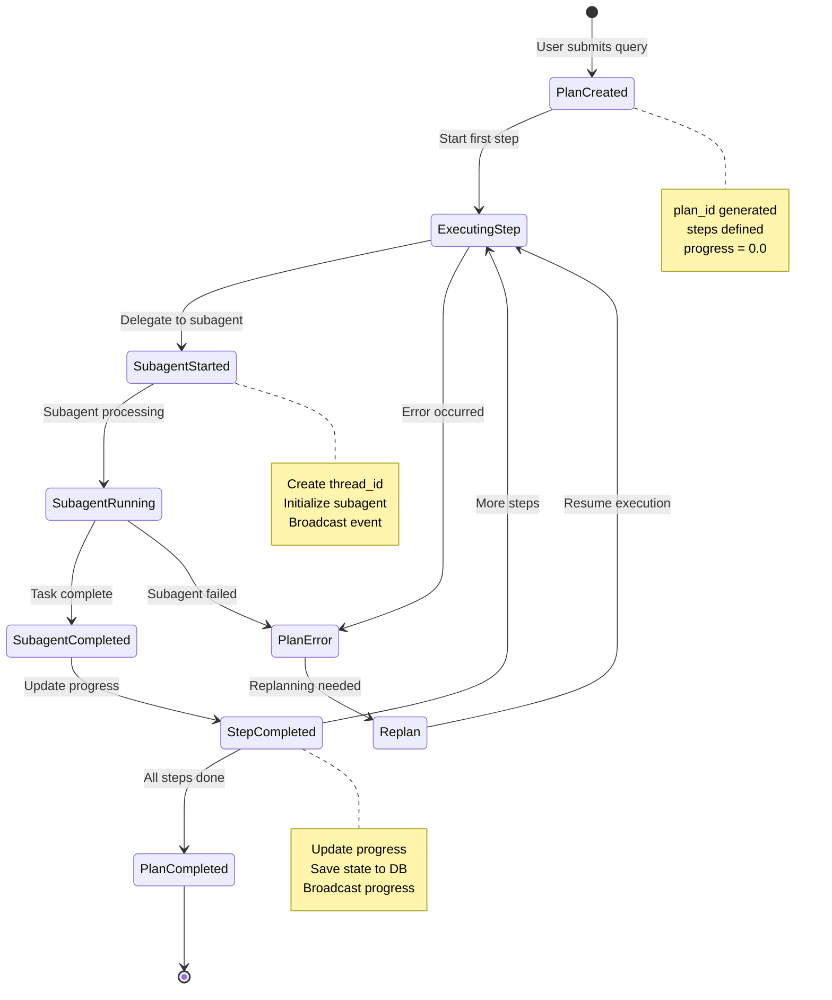

# Data Flow Diagrams

## System-Wide Data Flow Overview



## Research Query Data Flow



## State Persistence Data Flow

```mermaid
flowchart LR
    subgraph "Agent Runtime"
        AgentState[Agent State<br/>messages, logs, metadata]
        StateChange[State Change Event]
    end
    
    subgraph "Checkpointer"
        Serializer[State Serializer]
        Checkpointer[AsyncPostgresSaver]
    end
    
    subgraph "Database"
        CheckpointsTable[(checkpoints)]
        WritesTable[(writes)]
        ThreadsTable[(user_threads)]
    end
    
    subgraph "Recovery"
        Deserializer[State Deserializer]
        LoadState[Load State]
    end
    
    AgentState -->|onChange| StateChange
    StateChange -->|serialize| Serializer
    Serializer -->|write| Checkpointer
    
    Checkpointer -->|INSERT| CheckpointsTable
    Checkpointer -->|INSERT| WritesTable
    Checkpointer -->|UPDATE| ThreadsTable
    
    CheckpointsTable -->|SELECT| Checkpointer
    Checkpointer -->|deserialize| Deserializer
    Deserializer -->|restore| LoadState
    LoadState -->|resume| AgentState
    
    style Checkpointer fill:#336791,stroke:#234A66,color:#fff
    style CheckpointsTable fill:#4A5568,stroke:#2D3748,color:#fff
```

## File System Data Flow



## WebSocket Event Data Flow



## Evaluation Data Flow



## Message Flow Through Agent System



## Plan Execution State Transitions



## Data Types & Schemas

### Core Message Schema
```python
class Message:
    role: Literal["user", "assistant", "system"]
    content: str | List[ContentBlock]
    timestamp: datetime
    metadata: Dict[str, Any]
```

### Agent State Schema
```python
class AgentState(TypedDict):
    messages: List[BaseMessage]
    logs: List[LogEntry]
    plan: Optional[Plan]
    current_step: int
    progress: float
    thread_id: str
    user_id: str
```

### Plan Schema
```python
class Plan(BaseModel):
    plan_id: str
    query: str
    steps: List[str]  # 1-7 steps
    current_step: int
    progress: float  # 0.0 to 1.0
    past_steps: List[Tuple[str, str]]  # (step, result)
    status: Literal["active", "completed", "error"]
```

### File Metadata Schema
```python
class FileMetadata(BaseModel):
    size: int
    lastModified: float  # Unix timestamp
    extension: Optional[str]
```

### WebSocket Event Schema
```python
class WebSocketEvent(BaseModel):
    type: str  # event type
    thread_id: str
    timestamp: str  # ISO 8601
    data: Dict[str, Any]  # event-specific payload
```

---

## Data Flow Performance Characteristics

### Latency Targets
- **API Response Time**: < 200ms (excluding agent processing)
- **WebSocket Event Delivery**: < 50ms
- **Database State Save**: < 100ms
- **File Write Operations**: < 50ms
- **Agent Delegation**: < 500ms (includes state setup)

### Throughput
- **Concurrent Requests**: 100+ (FastAPI async)
- **WebSocket Connections**: 1000+ per instance
- **Database Writes/sec**: 50+ (PostgreSQL)
- **File Operations/sec**: 100+ (SSD dependent)

### Data Volumes
- **Average Message Size**: 1-5 KB
- **State Checkpoint Size**: 10-50 KB
- **Plan File Size**: 2-10 KB
- **Workspace File Size**: 1-1000 KB (reports/artifacts)
- **Database Growth**: ~100 MB per 1000 conversations

---

**Last Updated**: November 2025  
**Generated from**: ATLAS/TandemAI codebase analysis

